# 🎓 Complete MCP Learning System Guide
*A Comprehensive Educational Resource for Students*

## 📚 Table of Contents
1. [Introduction to MCP](#introduction-to-mcp)
2. [Core Concepts](#core-concepts)
3. [System Architecture](#system-architecture)
4. [MCP Components Deep Dive](#mcp-components-deep-dive)
5. [Communication Protocols](#communication-protocols)
6. [Request-Response Flow](#request-response-flow)
7. [Server Implementation](#server-implementation)
8. [Client Implementation](#client-implementation)
9. [Integration Patterns](#integration-patterns)
10. [Real-World Applications](#real-world-applications)
11. [Best Practices](#best-practices)
12. [Troubleshooting Guide](#troubleshooting-guide)
13. [System Monitoring](#system-monitoring)
14. [Future Enhancements](#future-enhancements)
15. [Learning Exercises](#learning-exercises)

---

## 🚀 Introduction to MCP

### What is the Model Context Protocol (MCP)?

The Model Context Protocol (MCP) is a revolutionary standardized communication protocol that enables AI models to seamlessly interact with external tools, resources, and data sources. Think of it as a universal translator that allows AI to "speak" with any external service.

```mermaid
graph TB
    subgraph "MCP Ecosystem"
        AI[🤖 AI Model<br/>Claude, GPT, Gemini]
        MCP[📡 MCP Protocol<br/>Standardized Communication]
        TOOLS[🛠️ External Tools<br/>APIs, Databases, Services]
    end
    
    AI <--> MCP
    MCP <--> TOOLS
    
    style AI fill:#e1f5fe,stroke:#000,stroke-width:2px,color:#000
    style MCP fill:#f3e5f5,stroke:#000,stroke-width:2px,color:#000
    style TOOLS fill:#e8f5e8,stroke:#000,stroke-width:2px,color:#000
```

### Why MCP Matters

Before MCP, each AI integration required custom code and unique implementations. MCP standardizes this process, making it:
- **Universal**: One protocol for all integrations
- **Scalable**: Easy to add new tools and services
- **Maintainable**: Standardized patterns reduce complexity
- **Secure**: Built-in security and permission models

---

## 🧠 Core Concepts

### The Three Pillars of MCP

```mermaid
graph LR
    subgraph "MCP Core Concepts"
        TOOLS[🔧 Tools<br/>Functions AI can call]
        RESOURCES[📁 Resources<br/>Data AI can access]
        PROMPTS[💭 Prompts<br/>Templates for AI]
    end
    
    TOOLS --> ACTION[Execute Actions]
    RESOURCES --> DATA[Access Information]
    PROMPTS --> GUIDE[Guide Behavior]
    
    style TOOLS fill:#fff3e0,stroke:#000,stroke-width:2px,color:#000
    style RESOURCES fill:#f1f8e9,stroke:#000,stroke-width:2px,color:#000
    style PROMPTS fill:#fce4ec,stroke:#000,stroke-width:2px,color:#000
    style ACTION fill:#e3f2fd,stroke:#000,stroke-width:2px,color:#000
    style DATA fill:#e3f2fd,stroke:#000,stroke-width:2px,color:#000
    style GUIDE fill:#e3f2fd,stroke:#000,stroke-width:2px,color:#000
```

### Tools: Functions AI Can Execute

Tools are the action-oriented components of MCP. They allow AI models to perform specific operations:

- **Weather Tools**: Get current weather conditions
- **Task Management**: Create, update, and manage tasks
- **Search Tools**: Find information on the web
- **File Operations**: Read, write, and manipulate files
- **Communication**: Send emails, messages, notifications
- **Calculations**: Perform mathematical operations

### Resources: Data AI Can Access

Resources provide AI models with access to information and data:

- **Documentation**: Technical guides and manuals
- **Personal Notes**: User-specific information
- **Configuration**: System settings and preferences
- **Logs**: Activity records and system logs
- **Databases**: Structured data storage
- **File Systems**: Documents and media files

### Prompts: Templates for AI Behavior

Prompts guide how AI models should behave and respond:

- **Assistant Mode**: Helpful and friendly responses
- **Technical Expert**: Detailed technical explanations
- **Creative Writer**: Imaginative and creative content
- **Data Analyst**: Factual and precise analysis
- **Educational**: Clear and instructive explanations
- **Customer Support**: Problem-solving focused responses

---

## 🏗️ System Architecture

### High-Level Architecture Overview

```mermaid
graph TB
    subgraph "User Interface Layer"
        WEB[🌐 Web Interface<br/>Streamlit Dashboard]
        CLI[💻 Command Line<br/>Direct Interaction]
        API[📡 REST API<br/>External Access]
    end
    
    subgraph "MCP Client Layer"
        CLIENT[🎯 MCP Client<br/>Request Orchestrator]
        MANAGER[📋 Connection Manager<br/>Server Management]
        CACHE[💾 Response Cache<br/>Performance Optimization]
    end
    
    subgraph "MCP Server Layer"
        PA_SERVER[🤖 Personal Assistant<br/>Task Management]
        KB_SERVER[📚 Knowledge Base<br/>Information Retrieval]
        WEATHER_SERVER[🌤️ Weather Server<br/>Weather Data]
        CUSTOM_SERVER[🔧 Custom Servers<br/>Extensible Services]
    end
    
    subgraph "External Services"
        GEMINI[🧠 Google Gemini<br/>AI Processing]
        WEATHER_API[🌍 OpenWeather API<br/>Weather Data]
        SEARCH_API[🔍 Tavily Search<br/>Web Search]
        DATABASE[🗄️ Database<br/>Persistent Storage]
    end
    
    WEB --> CLIENT
    CLI --> CLIENT
    API --> CLIENT
    CLIENT --> MANAGER
    CLIENT --> CACHE
    MANAGER --> PA_SERVER
    MANAGER --> KB_SERVER
    MANAGER --> WEATHER_SERVER
    MANAGER --> CUSTOM_SERVER
    
    PA_SERVER --> GEMINI
    PA_SERVER --> DATABASE
    KB_SERVER --> SEARCH_API
    KB_SERVER --> DATABASE
    WEATHER_SERVER --> WEATHER_API
    CUSTOM_SERVER --> DATABASE
    
    style WEB fill:#e3f2fd,stroke:#000,stroke-width:2px,color:#000
    style CLI fill:#e3f2fd,stroke:#000,stroke-width:2px,color:#000
    style API fill:#e3f2fd,stroke:#000,stroke-width:2px,color:#000
    style CLIENT fill:#f3e5f5,stroke:#000,stroke-width:2px,color:#000
    style MANAGER fill:#f3e5f5,stroke:#000,stroke-width:2px,color:#000
    style CACHE fill:#f3e5f5,stroke:#000,stroke-width:2px,color:#000
    style PA_SERVER fill:#fff3e0,stroke:#000,stroke-width:2px,color:#000
    style KB_SERVER fill:#fff3e0,stroke:#000,stroke-width:2px,color:#000
    style WEATHER_SERVER fill:#fff3e0,stroke:#000,stroke-width:2px,color:#000
    style CUSTOM_SERVER fill:#fff3e0,stroke:#000,stroke-width:2px,color:#000
    style GEMINI fill:#e8f5e8,stroke:#000,stroke-width:2px,color:#000
    style WEATHER_API fill:#e8f5e8,stroke:#000,stroke-width:2px,color:#000
    style SEARCH_API fill:#e8f5e8,stroke:#000,stroke-width:2px,color:#000
    style DATABASE fill:#e8f5e8,stroke:#000,stroke-width:2px,color:#000
```

### Data Flow Architecture

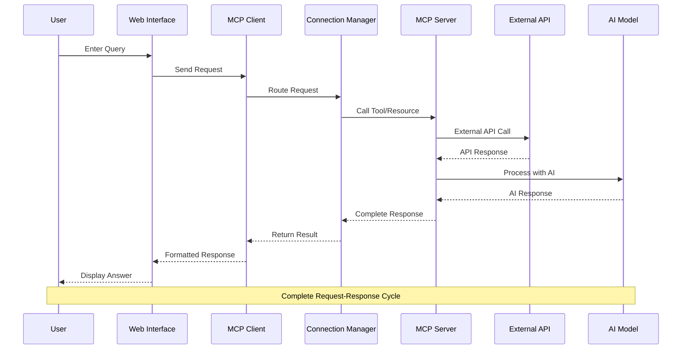

---

## 🔧 MCP Components Deep Dive

### MCP Server Components

```mermaid
graph TB
    subgraph "MCP Server Architecture"
        HANDLER[📨 Request Handler<br/>Process incoming requests]
        ROUTER[🎯 Request Router<br/>Route to appropriate handler]
        TOOLS[🛠️ Tool Registry<br/>Available functions]
        RESOURCES[📁 Resource Manager<br/>Data access]
        PROMPTS[💭 Prompt Library<br/>AI templates]
        VALIDATOR[✅ Input Validator<br/>Security & validation]
        EXECUTOR[⚡ Function Executor<br/>Execute operations]
        FORMATTER[📝 Response Formatter<br/>Format responses]
    end
    
    HANDLER --> ROUTER
    ROUTER --> VALIDATOR
    VALIDATOR --> TOOLS
    VALIDATOR --> RESOURCES
    VALIDATOR --> PROMPTS
    TOOLS --> EXECUTOR
    RESOURCES --> EXECUTOR
    PROMPTS --> EXECUTOR
    EXECUTOR --> FORMATTER
    FORMATTER --> HANDLER
    
    style HANDLER fill:#e1f5fe,stroke:#000,stroke-width:2px,color:#000
    style ROUTER fill:#fff3e0,stroke:#000,stroke-width:2px,color:#000
    style TOOLS fill:#f1f8e9,stroke:#000,stroke-width:2px,color:#000
    style RESOURCES fill:#fce4ec,stroke:#000,stroke-width:2px,color:#000
    style PROMPTS fill:#ffebee,stroke:#000,stroke-width:2px,color:#000
    style VALIDATOR fill:#f3e5f5,stroke:#000,stroke-width:2px,color:#000
    style EXECUTOR fill:#e8f5e8,stroke:#000,stroke-width:2px,color:#000
    style FORMATTER fill:#fff8e1,stroke:#000,stroke-width:2px,color:#000
```

### MCP Client Components

```mermaid
graph TB
    subgraph "MCP Client Architecture"
        UI[🖥️ User Interface<br/>Input/Output handling]
        SESSION[🔐 Session Manager<br/>User state management]
        ROUTER[🎯 Request Router<br/>Route to appropriate server]
        CONN_MGR[🔗 Connection Manager<br/>Manage server connections]
        CACHE[💾 Response Cache<br/>Performance optimization]
        ERROR_HANDLER[🚨 Error Handler<br/>Error management]
        FORMATTER[📝 Response Formatter<br/>Format responses]
        LOGGER[📝 Logger<br/>Activity logging]
    end
    
    UI --> SESSION
    SESSION --> ROUTER
    ROUTER --> CONN_MGR
    CONN_MGR --> CACHE
    CACHE --> ERROR_HANDLER
    ERROR_HANDLER --> FORMATTER
    FORMATTER --> LOGGER
    LOGGER --> UI
    
    style UI fill:#e3f2fd,stroke:#000,stroke-width:2px,color:#000
    style SESSION fill:#fff3e0,stroke:#000,stroke-width:2px,color:#000
    style ROUTER fill:#f3e5f5,stroke:#000,stroke-width:2px,color:#000
    style CONN_MGR fill:#f1f8e9,stroke:#000,stroke-width:2px,color:#000
    style CACHE fill:#fce4ec,stroke:#000,stroke-width:2px,color:#000
    style ERROR_HANDLER fill:#ffebee,stroke:#000,stroke-width:2px,color:#000
    style FORMATTER fill:#e8f5e8,stroke:#000,stroke-width:2px,color:#000
    style LOGGER fill:#fff8e1,stroke:#000,stroke-width:2px,color:#000
```

---

## 📡 Communication Protocols

### HTTP-Based MCP Communication

```mermaid
graph LR
    subgraph "HTTP MCP Protocol"
        CLIENT[📱 MCP Client]
        HTTP[🌐 HTTP Transport<br/>JSON over HTTP]
        SERVER[🖥️ MCP Server]
    end
    
    CLIENT -->|POST /mcp/call<br/>JSON Request| HTTP
    HTTP -->|Forward Request| SERVER
    SERVER -->|JSON Response| HTTP
    HTTP -->|HTTP 200<br/>JSON Response| CLIENT
    
    style CLIENT fill:#e1f5fe,stroke:#000,stroke-width:2px,color:#000
    style HTTP fill:#f3e5f5,stroke:#000,stroke-width:2px,color:#000
    style SERVER fill:#fff3e0,stroke:#000,stroke-width:2px,color:#000
```

### Message Format Structure

```mermaid
graph TB
    subgraph "MCP Message Structure"
        MSG[📨 MCP Message]
        
        subgraph "Header Section"
            METHOD[🎯 Method<br/>call_tool, list_resources]
            VERSION[📋 Version<br/>Protocol version]
            ID[🆔 Request ID<br/>Unique identifier]
        end
        
        subgraph "Parameters Section"
            TOOL_NAME[🛠️ Tool Name<br/>Function to call]
            ARGUMENTS[⚙️ Arguments<br/>Function parameters]
            CONTEXT[📊 Context<br/>Additional metadata]
        end
    end
    
    MSG --> METHOD
    MSG --> VERSION
    MSG --> ID
    MSG --> TOOL_NAME
    MSG --> ARGUMENTS
    MSG --> CONTEXT
    
    style MSG fill:#e1f5fe,stroke:#000,stroke-width:2px,color:#000
    style METHOD fill:#fff3e0,stroke:#000,stroke-width:2px,color:#000
    style VERSION fill:#f1f8e9,stroke:#000,stroke-width:2px,color:#000
    style ID fill:#fce4ec,stroke:#000,stroke-width:2px,color:#000
    style TOOL_NAME fill:#ffebee,stroke:#000,stroke-width:2px,color:#000
    style ARGUMENTS fill:#f3e5f5,stroke:#000,stroke-width:2px,color:#000
    style CONTEXT fill:#e8f5e8,stroke:#000,stroke-width:2px,color:#000
```

---

## 🔄 Request-Response Flow

### Complete Request Lifecycle

```mermaid
sequenceDiagram
    participant User
    participant UI as Streamlit UI
    participant Client as MCP Client
    participant Manager as Connection Manager
    participant Server as MCP Server
    participant API as External API
    participant AI as AI Model
    
    User->>UI: "What's the weather in London?"
    UI->>Client: Process user query
    Client->>Manager: Route weather request
    Manager->>Server: Call weather tool
    Server->>API: Get weather data
    API-->>Server: Weather response
    Server->>AI: Generate natural response
    AI-->>Server: Formatted answer
    Server-->>Manager: Complete response
    Manager-->>Client: Return result
    Client-->>UI: Display response
    UI-->>User: "London: 22°C, partly cloudy"
    
    Note over User,AI: End-to-End Request Processing
```

### Error Handling Flow

```mermaid
graph TB
    subgraph "Error Handling Pipeline"
        REQUEST[📨 Incoming Request]
        VALIDATE[✅ Validation Check]
        EXECUTE[⚡ Execute Operation]
        ERROR_CHECK[🔍 Error Detection]
        CATEGORIZE[📋 Categorize Error<br/>Network, Auth, Logic]
        RETRY[🔄 Retry Logic<br/>With exponential backoff]
        FALLBACK[🛡️ Fallback Handler<br/>Alternative response]
        LOG_ERROR[📝 Log Error<br/>For debugging]
        RESPONSE[📤 Error Response<br/>User-friendly message]
    end
    
    REQUEST --> VALIDATE
    VALIDATE -->|Valid| EXECUTE
    VALIDATE -->|Invalid| LOG_ERROR
    EXECUTE --> ERROR_CHECK
    ERROR_CHECK -->|Success| RESPONSE
    ERROR_CHECK -->|Error| CATEGORIZE
    CATEGORIZE --> RETRY
    RETRY -->|Retry Failed| FALLBACK
    RETRY -->|Retry Success| RESPONSE
    FALLBACK --> LOG_ERROR
    LOG_ERROR --> RESPONSE
    
    style REQUEST fill:#e1f5fe,stroke:#000,stroke-width:2px,color:#000
    style VALIDATE fill:#fff3e0,stroke:#000,stroke-width:2px,color:#000
    style EXECUTE fill:#f1f8e9,stroke:#000,stroke-width:2px,color:#000
    style ERROR_CHECK fill:#fce4ec,stroke:#000,stroke-width:2px,color:#000
    style CATEGORIZE fill:#ffebee,stroke:#000,stroke-width:2px,color:#000
    style RETRY fill:#f3e5f5,stroke:#000,stroke-width:2px,color:#000
    style FALLBACK fill:#e8f5e8,stroke:#000,stroke-width:2px,color:#000
    style LOG_ERROR fill:#fff8e1,stroke:#000,stroke-width:2px,color:#000
    style RESPONSE fill:#f0f4c3,stroke:#000,stroke-width:2px,color:#000
```

---

## 🖥️ Server Implementation

### Personal Assistant Server

The Personal Assistant Server manages tasks, notes, and reminders with AI integration:

**Key Features:**
- Task creation, updating, and completion tracking
- Personal note management with search capabilities
- Reminder system with scheduling
- AI-powered smart responses using Google Gemini
- JSON-based data persistence

**Available Tools:**
- `create_task`: Create new tasks with descriptions and priorities
- `list_tasks`: Retrieve tasks with filtering options
- `update_task`: Modify existing task details
- `complete_task`: Mark tasks as completed
- `create_note`: Add personal notes with categories
- `search_notes`: Find notes by keywords or content
- `set_reminder`: Schedule future notifications

### Knowledge Base Server

The Knowledge Base Server provides information retrieval and search capabilities:

**Key Features:**
- Web search integration using Tavily API
- Local document indexing and search
- Fact-checking and source verification
- Content summarization and analysis
- Multi-format document support

**Available Tools:**
- `web_search`: Search the internet for information
- `search_documents`: Find content in local documents
- `get_document`: Retrieve specific document content
- `summarize_content`: Create content summaries
- `fact_check`: Verify information accuracy

---

## 💻 Client Implementation

### Streamlit Web Interface

The Streamlit client provides an intuitive web-based interface:

**Features:**
- Chat-style conversation interface
- Real-time response streaming
- Session state management
- Error handling and user feedback
- Multi-server connection management

**Components:**
- **Main Chat Interface**: Primary user interaction area
- **Sidebar Controls**: Server selection and configuration
- **Message History**: Conversation persistence
- **Status Indicators**: Connection and processing status

### Connection Management

The client manages connections to multiple MCP servers:

**Connection Pool:**
- Maintains persistent HTTP connections
- Automatic retry with exponential backoff
- Health monitoring and failover
- Load balancing across server instances

**Error Handling:**
- Graceful degradation on server failures
- User-friendly error messages
- Automatic recovery mechanisms
- Detailed logging for debugging

---

## 🔗 Integration Patterns

### API Integration

```mermaid
graph TB
    subgraph "API Integration Pattern"
        MCP_SERVER[🖥️ MCP Server]
        API_CLIENT[📡 API Client]
        RATE_LIMITER[⏱️ Rate Limiter]
        CACHE[💾 Response Cache]
        ERROR_HANDLER[🚨 Error Handler]
        TRANSFORMER[🔄 Data Transformer]
    end
    
    MCP_SERVER --> API_CLIENT
    API_CLIENT --> RATE_LIMITER
    RATE_LIMITER --> CACHE
    CACHE --> ERROR_HANDLER
    ERROR_HANDLER --> TRANSFORMER
    TRANSFORMER --> MCP_SERVER
    
    style MCP_SERVER fill:#e1f5fe,stroke:#000,stroke-width:2px,color:#000
    style API_CLIENT fill:#fff3e0,stroke:#000,stroke-width:2px,color:#000
    style RATE_LIMITER fill:#f1f8e9,stroke:#000,stroke-width:2px,color:#000
    style CACHE fill:#fce4ec,stroke:#000,stroke-width:2px,color:#000
    style ERROR_HANDLER fill:#ffebee,stroke:#000,stroke-width:2px,color:#000
    style TRANSFORMER fill:#f3e5f5,stroke:#000,stroke-width:2px,color:#000
```

### Database Integration

For persistent data storage, MCP servers can integrate with various databases:

**Supported Patterns:**
- **JSON File Storage**: Simple file-based persistence
- **SQLite Integration**: Lightweight relational database
- **PostgreSQL/MySQL**: Full-featured database systems
- **NoSQL Databases**: MongoDB, Redis for flexible schemas
- **Cloud Databases**: AWS RDS, Google Cloud SQL

**Best Practices:**
- Use connection pooling for performance
- Implement proper transaction management
- Add caching layers for frequently accessed data
- Ensure data validation and sanitization
- Implement backup and recovery procedures

---

## 🌍 Real-World Applications

### E-Commerce Assistant

An MCP-powered e-commerce assistant can:

- **Product Search**: Find products based on user preferences
- **Price Comparison**: Compare prices across multiple vendors
- **Order Management**: Track orders and manage returns
- **Recommendation Engine**: Suggest products based on history
- **Customer Support**: Answer questions and resolve issues

### Healthcare Management

Healthcare applications using MCP can provide:

- **Appointment Scheduling**: Book and manage medical appointments
- **Medical Records**: Access and update patient information
- **Prescription Management**: Track medications and refills
- **Health Monitoring**: Integrate with wearable devices
- **Emergency Services**: Quick access to emergency contacts

### Smart Home Control

Smart home systems can leverage MCP for:

- **Device Control**: Manage lights, thermostats, and appliances
- **Security Monitoring**: Monitor cameras and alarm systems
- **Energy Management**: Optimize power consumption
- **Automation Rules**: Create custom automation scenarios
- **Voice Integration**: Natural language device control

---

## ✅ Best Practices

### Security Best Practices

**Authentication & Authorization:**
- Use strong API keys and tokens
- Implement role-based access control
- Regular credential rotation
- Multi-factor authentication where possible

**Data Protection:**
- Encrypt data in transit and at rest
- Implement proper input validation
- Use HTTPS for all communications
- Regular security audits and updates

**Rate Limiting & Abuse Prevention:**
- Implement request rate limiting
- Monitor for unusual activity patterns
- Use CAPTCHA for public endpoints
- Implement circuit breakers for external services

### Performance Optimization

**Caching Strategies:**
- Cache frequently accessed data
- Use appropriate cache expiration policies
- Implement cache invalidation mechanisms
- Consider distributed caching for scalability

**Connection Management:**
- Use connection pooling
- Implement proper timeout settings
- Monitor connection health
- Use load balancing for high availability

**Resource Optimization:**
- Monitor memory and CPU usage
- Implement proper garbage collection
- Use asynchronous processing where appropriate
- Optimize database queries and indexes

### Development Guidelines

**Code Quality:**
- Follow consistent coding standards
- Implement comprehensive error handling
- Write unit and integration tests
- Use version control effectively

**Documentation:**
- Maintain up-to-date API documentation
- Include code comments and examples
- Create user guides and tutorials
- Document deployment procedures

**Monitoring & Logging:**
- Implement comprehensive logging
- Monitor system performance metrics
- Set up alerting for critical issues
- Regular log analysis and cleanup

---

## 🔧 Troubleshooting Guide

### Common Issues

**Connection Problems:**
- Check network connectivity
- Verify server endpoints and ports
- Validate API keys and credentials
- Review firewall and security settings

**Performance Issues:**
- Monitor system resource usage
- Check database query performance
- Review cache hit rates
- Analyze network latency

**Authentication Errors:**
- Verify API key validity
- Check token expiration
- Review permission settings
- Validate request signatures

### Debugging Techniques

**Logging Analysis:**
- Enable detailed logging
- Use structured log formats
- Implement log aggregation
- Set up log monitoring alerts

**Performance Profiling:**
- Use profiling tools to identify bottlenecks
- Monitor database query performance
- Analyze memory usage patterns
- Track request/response times

**Testing Strategies:**
- Implement unit tests for individual components
- Create integration tests for end-to-end flows
- Use load testing for performance validation
- Implement automated testing pipelines

---

## 📊 System Monitoring

### Key Metrics

**Performance Metrics:**
- Response time (average, 95th percentile)
- Throughput (requests per second)
- Error rate (percentage of failed requests)
- Resource utilization (CPU, memory, disk)

**Business Metrics:**
- User engagement and satisfaction
- Feature usage statistics
- Cost per request
- System availability and uptime

**Security Metrics:**
- Failed authentication attempts
- Suspicious activity patterns
- Security vulnerability assessments
- Compliance audit results

### Monitoring Tools

**Application Monitoring:**
- Use APM tools like New Relic or Datadog
- Implement custom metrics collection
- Set up real-time dashboards
- Configure automated alerting

**Infrastructure Monitoring:**
- Monitor server health and performance
- Track network connectivity and latency
- Monitor database performance
- Implement log aggregation and analysis

---

## 🚀 Future Enhancements

### Planned Features

**Enhanced AI Integration:**
- Support for multiple AI models
- Model selection based on task type
- Fine-tuning capabilities for specific domains
- Advanced context management

**Improved Scalability:**
- Microservices architecture
- Container orchestration with Kubernetes
- Auto-scaling based on demand
- Global content delivery network

**Advanced Security:**
- Zero-trust security model
- Advanced threat detection
- Automated security scanning
- Compliance framework integration

### Emerging Technologies

**Edge Computing:**
- Local processing capabilities
- Reduced latency for real-time applications
- Offline functionality
- Privacy-preserving computation

**Blockchain Integration:**
- Decentralized identity management
- Smart contract integration
- Immutable audit trails
- Cryptocurrency payment support

**IoT Connectivity:**
- Direct device integration
- Real-time sensor data processing
- Edge AI capabilities
- Massive device scalability

---

## 🎓 Learning Exercises

### Beginner Projects

1. **Simple Weather Bot**: Create a basic MCP server that provides weather information
2. **Task Manager**: Build a personal task management system
3. **Note Taking App**: Develop a note-taking application with search capabilities

### Intermediate Projects

1. **Multi-Service Chatbot**: Integrate multiple MCP servers into a unified interface
2. **Document Search Engine**: Build a system for searching and analyzing documents
3. **API Gateway**: Create a gateway that routes requests to appropriate MCP servers

### Advanced Projects

1. **AI-Powered Assistant**: Develop a comprehensive AI assistant with multiple capabilities
2. **IoT Control System**: Build a system for managing IoT devices
3. **Business Intelligence Platform**: Create a data analysis and reporting system

### Assessment Criteria

**Technical Skills:**
- Code quality and organization
- Proper error handling and validation
- Security implementation
- Performance optimization

**Problem-Solving:**
- Ability to debug and troubleshoot issues
- Creative solutions to complex problems
- Effective use of available tools and resources
- Adaptation to changing requirements

**Communication:**
- Clear documentation and comments
- Effective presentation of solutions
- Collaboration with team members
- User-friendly interface design

---

## 📝 Summary

The Model Context Protocol (MCP) represents a significant advancement in AI-tool integration, providing a standardized, scalable, and secure framework for connecting AI models with external services. This guide has covered:

### Key Concepts Learned

1. **MCP Fundamentals**: Understanding the core concepts of tools, resources, and prompts
2. **Architecture Design**: How to structure scalable MCP systems
3. **Implementation Techniques**: Practical approaches to building servers and clients
4. **Integration Patterns**: Best practices for connecting external services
5. **Security & Performance**: Essential considerations for production systems
6. **Real-World Applications**: Practical use cases across various industries

### Skills Developed

- **Server Development**: Creating robust MCP servers with proper error handling
- **Client Implementation**: Building user-friendly interfaces for MCP systems
- **API Integration**: Connecting with external services and APIs
- **Security Implementation**: Applying security best practices
- **Performance Optimization**: Techniques for improving system performance
- **Troubleshooting**: Systematic approaches to debugging and problem-solving

### Next Steps

1. **Practice**: Build your own MCP servers and clients
2. **Experiment**: Try integrating different APIs and services
3. **Contribute**: Join the MCP community and contribute to open-source projects
4. **Innovate**: Create novel applications that leverage MCP's capabilities
5. **Share**: Document your learnings and help others in their MCP journey

---

## 🎯 Getting Started

### Quick Setup Commands

```bash
# Clone the repository
git clone <repository-url>
cd mcp_project

# Create virtual environment
python -m venv venv

# Activate virtual environment (Windows)
venv\Scripts\activate

# Activate virtual environment (macOS/Linux)
source venv/bin/activate

# Install dependencies
pip install -r requirements.txt

# Configure environment variables
cp .env.template .env
# Edit .env with your API keys

# Start the system
python start_system.py
```

### Essential Configuration

1. **API Keys**: Configure your Google Gemini, OpenWeather, and Tavily API keys
2. **Server Ports**: Ensure ports 8001, 8002 are available
3. **Python Version**: Requires Python 3.11 or higher
4. **Dependencies**: All required packages are listed in requirements.txt

---

## 📚 Additional Resources

### Documentation
- [MCP Official Specification](https://modelcontextprotocol.io/)
- [Python Documentation](https://docs.python.org/)
- [Streamlit Documentation](https://docs.streamlit.io/)
- [FastAPI Documentation](https://fastapi.tiangolo.com/)

### Community
- GitHub Repository: [MCP Learning System](https://github.com/your-repo)
- Discord Community: [MCP Developers](https://discord.gg/mcp)
- Stack Overflow: Tag questions with `model-context-protocol`

### Learning Materials
- Video tutorials and workshops
- Interactive coding exercises
- Real-world case studies
- Academic research papers

---

*🎓 Congratulations on completing the MCP Learning Journey! The future of AI-tool integration is in your hands. Go build something amazing! 🚀*

---

**© 2025 MCP Learning System. Open-source under MIT License.**