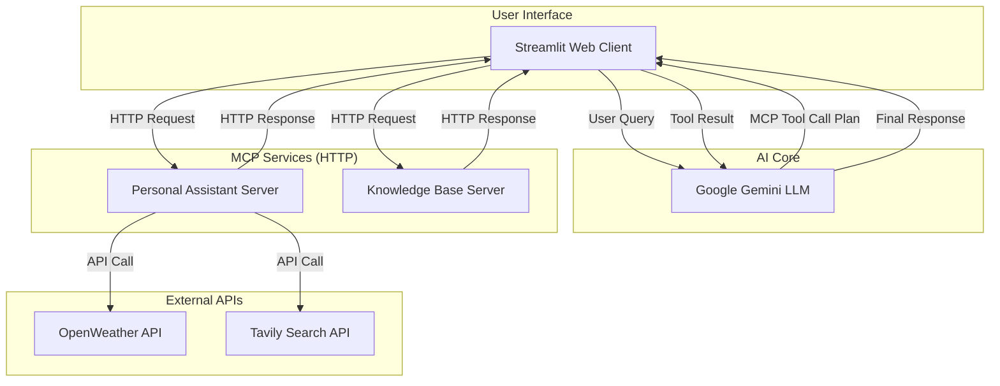
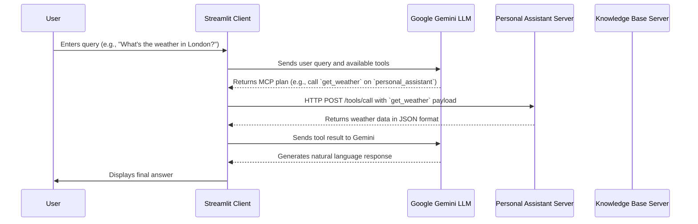

# MCP Learning System: A Deep Dive

This document provides a comprehensive overview of the MCP Learning System, a production-ready implementation of the Model Context Protocol (MCP). It is designed to be a technical guide for developers, architects, and anyone interested in understanding the inner workings of the system.

## 1. What is the Model Context Protocol (MCP)?

The Model Context Protocol (MCP) is a standardized communication protocol that enables Large Language Models (LLMs) to interact with external tools and services. It acts as a bridge between the AI's conversational abilities and the vast world of APIs, databases, and other software components.

### Core Concepts

- **MCP Server**: An application that exposes a set of capabilities (tools and resources) to an LLM. In our system, the **Personal Assistant** and **Knowledge Base** are MCP servers.
- **MCP Client**: An application that facilitates communication between an LLM and one or more MCP servers. Our **Streamlit Chat Interface** is an MCP client.
- **Tools**: Functions that the LLM can call to perform actions. For example, `get_weather` or `add_task`.
- **Resources**: Data sources that the LLM can access for information. For example, a list of tasks or a knowledge base article.

### Why MCP?

MCP provides a structured way for LLMs to:
- **Extend their capabilities**: Go beyond text generation to perform real-world actions.
- **Access real-time information**: Get up-to-date data from APIs (e.g., weather, news).
- **Interact with private data**: Connect to internal databases and knowledge bases securely.
- **Standardize tool usage**: Create a consistent way for different LLMs to use the same tools.

---

## 2. System Architecture

This project uses a microservices architecture, where each MCP server is an independent FastAPI service. This design is highly scalable, maintainable, and resilient.

### High-Level Architecture Diagram



### End-to-End Request Flow (Sequence Diagram)

This diagram shows the step-by-step process of a user query being handled by the system.



---

## 3. How It Works: An End-to-End Journey

Let's trace a user's request through the system to understand how all the components work together.

**Scenario**: A user types "What's the weather in London?" into the chat interface.

1.  **User Input (Streamlit Client)**: The `streamlit_chat.py` interface captures the user's query.

2.  **LLM Consultation (Gemini)**: The client sends the query to the Google Gemini LLM, along with a list of all available tools from the connected MCP servers (e.g., `get_weather`, `add_task`, `search_notes`).

3.  **MCP Plan Generation**: Gemini analyzes the query and determines that it needs to use the `get_weather` tool. It then generates an "MCP plan" in a structured JSON format, which looks something like this:
    ```json
    {
      "tool_calls": [
        {
          "server": "personal_assistant",
          "name": "get_weather",
          "arguments": {"city": "London"}
        }
      ]
    }
    ```

4.  **Client-Side Execution**: The Streamlit client receives this plan. The `http_mcp_manager.py` is responsible for parsing this plan and executing the tool calls.

5.  **HTTP Request to MCP Server**: The client makes an HTTP POST request to the Personal Assistant server at `http://localhost:8001/tools/call`, with the tool name and arguments in the request body.

6.  **MCP Server Logic**: The `http_server.py` in the Personal Assistant server receives the request and calls the corresponding function in its core `server.py` logic. This function might then call an external API (like OpenWeather).

7.  **HTTP Response**: The MCP server sends the result of the tool call (the weather data) back to the client as a JSON response.

8.  **Final LLM Response Generation**: The client sends the tool's result back to Gemini. Gemini then uses this information to generate a user-friendly, natural language response (e.g., "The weather in London is currently...").

9.  **Display to User**: The final response is displayed in the Streamlit chat interface.

This entire process allows the LLM to leverage external tools to answer questions and perform actions far beyond its built-in capabilities.

---

## 4. Component Deep Dive

This section provides a closer look at the key files and their roles within the system.

### Client Components

-   **`client/streamlit_chat.py`**: The main entry point for the user interface.
    -   **Responsibilities**: Renders the chat window, handles user input, and displays the final response from the LLM. It orchestrates the entire client-side workflow.

-   **`client/http_mcp_manager.py`**: The heart of the client's MCP communication.
    -   **Responsibilities**: Manages connections to all MCP servers, discovers their available tools, executes tool calls based on the LLM's plan, and handles the HTTP request/response cycle. It also includes robust error handling and client lifecycle management.

-   **`client/config.py`**: Client-side configuration.
    -   **Responsibilities**: Defines the host and port for each MCP server, allowing for easy configuration without hardcoding values.

### Server Components

-   **`servers/personal_assistant/server.py`** and **`servers/knowledge_base/server.py`**: These files contain the core logic for each MCP server.
    -   **Responsibilities**: Define the tools and resources that the server provides. They implement the actual business logic for each tool (e.g., calling the OpenWeather API or searching the knowledge base).

-   **`servers/personal_assistant/http_server.py`** and **`servers/knowledge_base/http_server.py`**: These are the FastAPI wrappers that expose the MCP servers as HTTP services.
    -   **Responsibilities**: Create API endpoints for tool calls, resource access, and health checks. They handle the translation between HTTP requests and the server's internal MCP logic.

### Shared Components & Root Files

-   **`start_system.py`**: A convenience script for starting all system components.
    -   **Responsibilities**: Launches the Personal Assistant server, Knowledge Base server, and Streamlit client in separate processes, making it easy to get the entire system running with a single command.

-   **`requirements.txt`**: The list of Python dependencies for the project.

-   **`.env.template`**: A template for the required environment variables, including API keys.

---

## 5. Setup and Installation

### Prerequisites
- Python 3.11+
- Virtual environment support
- API Keys (see Configuration section)

### Quick Start

1.  **Clone and Setup**
    ```bash
    cd mcp_project
    python -m venv venv
    venv\Scripts\activate  # Windows
    # source venv/bin/activate  # Linux/Mac
    pip install -r requirements.txt
    ```

2.  **Configure Environment**
    ```bash
    cp .env.template .env
    # Edit .env with your API keys (see Configuration section)
    ```

3.  **Start Services**
    ```bash
    # Use the convenient start_system.py script
    python start_system.py
    ```
    Alternatively, you can run each component in a separate terminal:
    ```bash
    # Terminal 1: Personal Assistant Server
    python -m servers.personal_assistant.http_server

    # Terminal 2: Knowledge Base Server
    python -m servers.knowledge_base.http_server

    # Terminal 3: Web Interface
    streamlit run client/streamlit_chat.py --server.port 8501
    ```

4.  **Access Application**
    -   Web Interface: http://localhost:8501
    -   Personal Assistant API Docs: http://localhost:8001/docs
    -   Knowledge Base API Docs: http://localhost:8002/docs

### Configuration

Create a `.env` file in the project root with the following keys:

```env
# Google Gemini API (Required)
GOOGLE_API_KEY=your_gemini_api_key_here

# OpenWeather API (Required for weather features)
OPENWEATHER_API_KEY=your_openweather_api_key_here

# Tavily Search API (Required for web search)
TAVILY_API_KEY=your_tavily_api_key_here